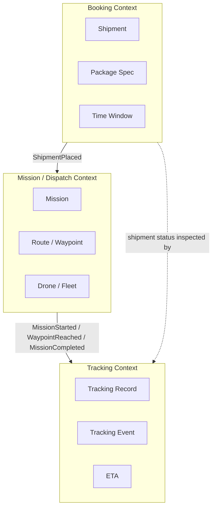
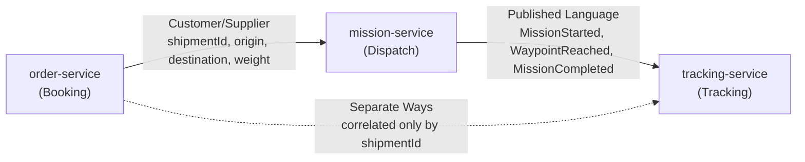
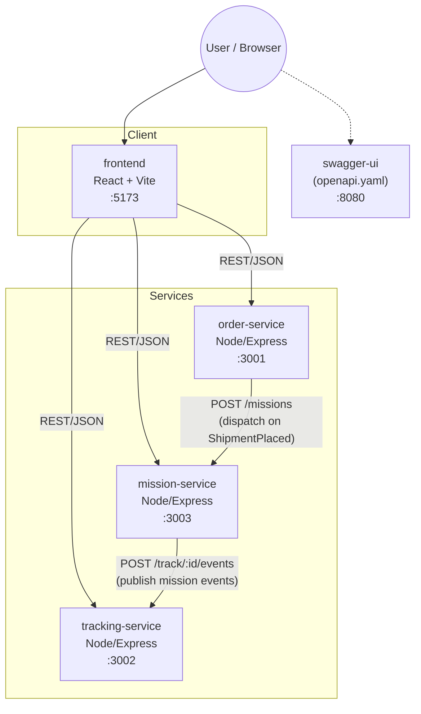
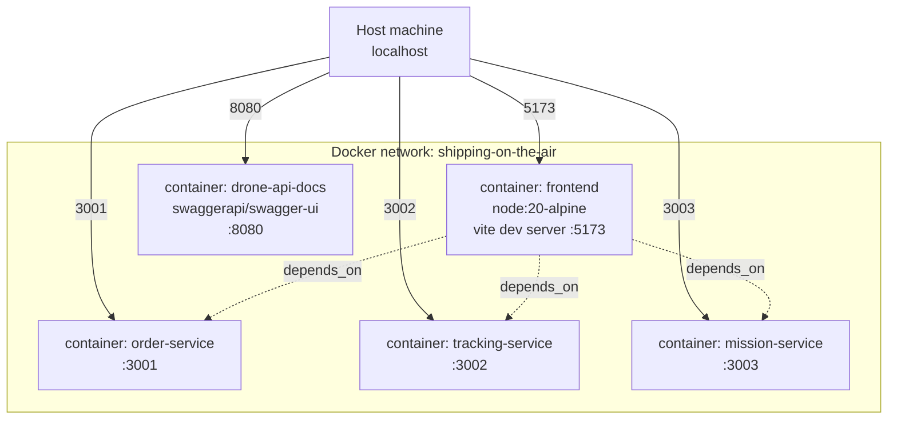

# 02 — Design

> Shipping on the Air — Assignment #01, Software Architecture and Platforms, a.y. 2025-2026

This document covers the **Domain-Driven Design** (strategic + tactical) used to derive
the domain model from the requirements in [01-analysis.md](./01-analysis.md), and the
resulting **microservices architecture**.

---

## 1. Ubiquitous Language

| Term | Meaning |
|---|---|
| **Shipment** | A customer's request to move a package from an origin to a destination within a time window. |
| **Package spec** | Physical characteristics of the package relevant to delivery (weight, fragility). |
| **Time window** | Earliest/latest acceptable delivery time requested by the customer. |
| **Mission** | The operational act of a specific drone flying a specific route to fulfil a shipment. |
| **Route / Waypoint** | The ordered sequence of geographic points a drone follows during a mission. |
| **Drone** | A fleet vehicle with a payload capacity, battery level, and availability status. |
| **Tracking record** | The live state of a shipment in transit: current location, ETA, progress, event log. |
| **Tracking event** | A timestamped fact appended to a tracking record (e.g. `WAYPOINT_REACHED`). |
| **ETA** | Estimated time of arrival, derived from mission progress. |

This vocabulary is used consistently across code (variable/route names), the OpenAPI
spec, and this document — this is what "ubiquitous" means in DDD: the same words are
used by domain experts, docs, and code.

---

## 2. Strategic Design: Bounded Contexts

Three bounded contexts are identified, directly reflecting the three concerns
identified in the analysis (booking, dispatching, observing):



Each bounded context maps 1:1 onto a microservice:

| Bounded Context | Microservice | Responsibility |
|---|---|---|
| Booking | `order-service` | Owns the shipment lifecycle: create, read, update status, cancel. |
| Mission / Dispatch | `mission-service` | Owns drone assignment and route computation; owns the fleet. |
| Tracking | `tracking-service` | Owns live position, ETA, progress and the event history. |

### Context Map

The relationships between contexts, using standard DDD context-mapping patterns:

- **Booking → Mission**: *Customer/Supplier*. Booking is the upstream trigger
  (a placed shipment is what causes a mission to be created), but Mission does not
  need to know Booking's internals — only the minimal data (`shipmentId`, `origin`,
  `destination`, `packageWeight`) needed to dispatch.
- **Mission → Tracking**: *Published Language*. Mission emits well-known event types
  (`MISSION_STARTED`, `WAYPOINT_REACHED`, ...) that Tracking consumes and appends to
  its own record, without Tracking needing to understand Mission's internal route
  model.
- **Booking ↔ Tracking**: *Separate Ways* (data-wise). They share only the
  `shipmentId` as a correlation key; a user-facing view stitches both together, but
  neither context depends on the other's schema.



---

## 3. Tactical Design

### 3.1 Booking context (`order-service`)

- **Aggregate root:** `Shipment`
  - Identity: `id` (e.g. `SHP-001`)
  - Value objects: `Location {address, lat, lon}`, `PackageSpec {weight, fragile}`,
    `TimeWindow {earliest, latest}`
  - State: `status ∈ {PENDING, CONFIRMED, IN_TRANSIT, DELIVERED, CANCELLED}`
- **Domain events raised:** `ShipmentPlaced`, `ShipmentStatusChanged`, `ShipmentCancelled`
- **Invariants enforced:** a shipment cannot be created without `origin`,
  `destination`, and `packageSpec`; status transitions are restricted to a known set.

### 3.2 Mission/Dispatch context (`mission-service`)

- **Aggregate root:** `Mission`
  - Identity: `id` (e.g. `MSN-001`)
  - References `shipmentId` (from Booking) and `droneId` (from the fleet)
  - Value object: `Route { waypoints: [Waypoint] }`, `Waypoint {order, lat, lon, alt, label}`
  - State: `status ∈ {IN_PROGRESS, COMPLETED, ABORTED}`
- **Entity:** `Drone {id, model, battery, maxPayload, status}` — part of the Fleet,
  not the Mission aggregate itself, since drones outlive any single mission.
- **Domain events raised:** `MissionStarted`, `MissionCompleted`, `MissionAborted`
- **Invariants enforced:** a mission can only start with a drone that is `AVAILABLE`,
  has battery above a safety threshold, and whose `maxPayload` covers the package
  weight; completing/aborting a mission always releases the drone back to `AVAILABLE`.

### 3.3 Tracking context (`tracking-service`)

- **Aggregate root:** `TrackingRecord`
  - Identity: `shipmentId` (correlation key shared with Booking, not a foreign key)
  - State: `currentLocation`, `eta`, `progress`, `droneId`
  - Contains: ordered list of `TrackingEvent {timestamp, type, description}`
- **Domain events consumed:** anything Mission publishes; appended as `TrackingEvent`s
- **Invariants enforced:** events are always appended (never mutated/deleted),
  preserving an audit trail of the delivery.

---

## 4. Microservices Architecture

Each bounded context is realised as an independently deployable Node.js/Express
service with its own container, matching the "one service per bounded context"
principle used to keep service boundaries aligned with domain boundaries (avoiding
both a monolith and an overly-fragmented, anemic split).



### Deployment view (Docker Compose)

All five components run as separate containers on a shared Docker network, orchestrated
by `docker-compose.yml`, so the whole distributed system starts with one command
(`docker compose up --build -d`) — satisfying NFR-7 (local reproducibility).



### Communication style

The current prototype uses **synchronous REST/JSON** for all inter-service calls
(`order-service → mission-service → tracking-service`), which is simple to run and
demo locally.

This is a deliberate, documented simplification: the DDD context map above
(§2, "Published Language" between Mission and Tracking) implies an **event-driven**
integration style would be architecturally preferable in production — decoupling
publishers from subscribers and improving the partial-failure tolerance required by
NFR-3. The code already marks these seams explicitly, e.g.:

```js
// In production: publish ShipmentPlaced event to Kafka here
```

A production evolution would introduce a message broker (e.g. Kafka) and have
`order-service` and `mission-service` publish domain events rather than making direct
HTTP calls to their downstream context, with `tracking-service` (and any future
consumer) subscribing independently.

### API contracts

The shared contract between the frontend and all three services is captured formally
in [`openapi.yaml`](../openapi.yaml) at the repository root, and served as interactive
documentation via Swagger UI on port `8080` — this is the "explicit, stable contract"
required by NFR-5, versioned in the same repository as the code that implements it.

---

## 5. Traceability Summary

| Requirement | Bounded Context | Service |
|---|---|---|
| FR-1..4 | Booking | `order-service` |
| FR-5, FR-6, FR-9 | Mission/Dispatch | `mission-service` |
| FR-7, FR-8 | Tracking | `tracking-service` |
| NFR-1, NFR-2, NFR-3 | — (cross-cutting) | service boundary design |
| NFR-4 | — (cross-cutting) | domain event design (§3) |
| NFR-5 | — (cross-cutting) | `openapi.yaml` |
| NFR-6 | Tracking | `tracking-service` |
| NFR-7 | — (cross-cutting) | `docker-compose.yml` |
